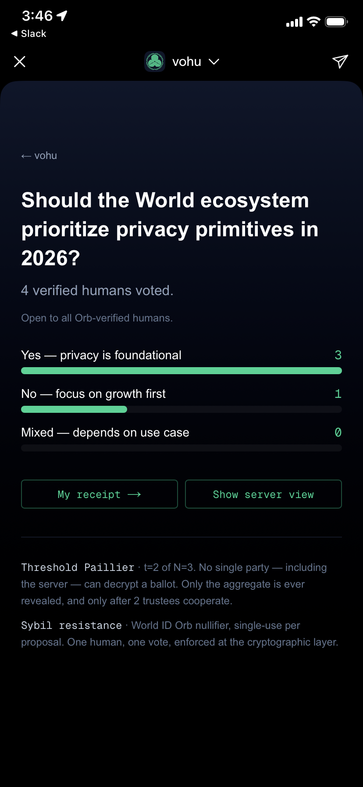

<div align="center">


# vohu

**検証済みの人間による、暗号化された投票。**

[World](https://world.org) 向けのプライバシー保護投票 Mini App。
World ID が「一人一票」を保証し、投票内容は端末上で加法準同型暗号（Paillier）で暗号化される。
サーバーは暗号文のまま集計し、**集計結果だけが復号される**（個票は永久に暗号のまま）。

[World Build 3 / 2026年4月 出場作品](https://worldbuildlabs.com) · [デプロイ](https://vohu.vercel.app) · [World App で開く](https://world.org/mini-app?app_id=app_7ef7c4ad41af2d289fd9312a18bb8d68)

[English README →](./README.md)

</div>

---

## vohu は primitive の hello world

**研究中の primitive:** *検証済み人間に対する閾値準同型集計 / マッチング*。Orb 検証済み人間のグループが合意で aggregate 出力（合計、マッチ、交差）を生成し、個別入力は一切復号されず、復号鍵は誰一人単独で持たない。

**このリポジトリで shipped されているアプリケーション:** プライベート投票 Mini App。投票は primitive を production で動作実証する最もクリーンな面: 集計は純加算、aggregate こそが答え、脅威モデルは 3 分ピッチで説明しきれる。primitive がこのデモを超えて成熟したとき、同じ数学が同じ検証済み人間層の上で matching / 閾値合意 / センシティブ属性適合に使える。

つまり階層構造は:

```
[ 検証済み人間 threshold 準同型集計 ]     ← primitive（研究トラック）
                    ▲   使うもの: plat (FHE), hyde (PQC), argo (ZKP), World ID (PoP)
                    │
[ vohu: 最初のアプリケーション ]           ← 今日動くもの（このレポ）
                    │
[ 将来のアプリ: matching, coordination, compatibility ]   ← 別サーフェス、同じ primitive
```

### Primitive 成熟度ロードマップ

| 段階 | 内容 | 状態 | vohu への影響 |
|---|---|---|---|
| v1 | single-trustee Paillier → 2-of-3 threshold Paillier | **shipped**（このレポ） | 「単一オペレータ + 公開された信頼モデル」が許容される用途で production-ready |
| v2 | 分散 trustee デバイス + 部分復号の検証可能化 (NIZK) | 研究（Seoul Build Week） | 単一 host が share を持たない、byzantine trustee が暗号学的に排除 |
| v3 | 分散鍵生成 (no trusted dealer) + MACI 風鍵ローテーションによる bribery 耐性 | 研究 | 暗号学的 endgame — λ は single object として存在しない |
| v4 | [`plat`](https://gitlab.com/Ryujiyasu/plat) 経由の格子ベース FHE (BFV / BGV / TFHE) | 研究 | Post-quantum、かつ集計関数が純加算を超える — ranked-choice, quadratic, weighted-delegation, matching, 適合 |
| v5 | primitive as a service — 他の Mini App が vohu の threshold 層で動く | 研究 | vohu は「アプリ」であることを止め、「基盤」になる。階層がカテゴリに畳み込まれる |

v1 が今日 ballot を投げられる範囲。v1 より下は research ロードマップで、プロダクト約束ではなく「長期的 thesis」。ハッカソンのデモと混同されないよう明示的に分離。

---

## Why now

2026 年 4 月 17 日 — World Build 3 のちょうど 1 週間前 — World ID 4.0 が **credential issuer registry** と共にリリースされた。identity 層が任意の検証済み属性に開かれた瞬間。Government ID は既に live、employment / education / reputation が進行中、health records と task completion は公開ロードマップ。Tinder、Zoom、DocuSign、Okta、Vercel、Browserbase、Exa がリリース 1 週間で統合。

これが aggregation primitive にとって何を意味するか: World の検証済み人間は近く **署名済み属性のコンテナ** を各人持つことになる。identity コンテナだけで aggregation 層がない状態は半分のシステム — ballot は投げられるが、salary median、HLA 適合性チェック、surveys-of-surveys、臓器ドナーマッチはどれも「identity 層が守ろうとした平文プールを誰かが再構成する」ことなしには走らない。

**Identity 層は World。Aggregation 層は vohu。** 投票は最初のアプリケーション; production で数学が成立することを最もクリーンに証明する面。matching、閾値合意、センシティブ属性適合は同じ primitive の別のアプリケーション面で、credential registry が埋まっていくにつれどれも射程に入る。

---

## 解決したい問題

既存の投票ツールはトレードオフの袋小路にある:

| ツール | Sybil 耐性 | 投票秘匿 | 集計の信頼最小化 |
|---|---|---|---|
| Google Forms / SurveyMonkey / 社内アンケート | ❌ 一人で千票入れられる | ❌ 管理者が全票見える | ❌ |
| オンチェーン DAO 投票（Snapshot, Tally） | 🟡 トークン数ベース（人間数ではない） | ❌ 全票が永久公開台帳に残る | ❌ |
| World App 標準 Polls | ✅ World ID = 一人 | ❌ サーバーが全票見える | ❌ |
| **vohu** | ✅ **World ID 4.0 Orb + 単発使用 nullifier** | ✅ **Paillier 暗号文のみ保持** | ✅ **閾値 Paillier — t-of-N trustee が協調して集計のみ復号** |

vohu は World 上でこの 3 条件を同時に満たす最初の Mini App。

## 体験イメージ

```
┌───────────────────────────┐     ┌───────────────────────────┐
│  🔒 Verify with World ID  │ →   │  ✓ HUMAN VERIFIED         │
│  Orb、匿名                 │     │  投票画面                  │
└───────────────────────────┘     │  ○ Yes  ● Mixed  ○ No     │
                                  │  [暗号化して投票]          │
                                  └──────────┬────────────────┘
                                             ↓
                                  ┌───────────────────────────┐
                                  │  7 人が投票               │
                                  │  Yes   ████████░░  4      │
                                  │  Mixed ████░░░░░░  2      │
                                  │  No    ██░░░░░░░░  1      │
                                  │  🔒 [server sees only     │
                                  │      ciphertexts]         │
                                  └───────────────────────────┘
```

3 タップで完了: 認証 → 投票 → 集計表示。

## しくみ

```
┌──────────────────────────────────────────────────────────────┐
│  World App (WebView)                                         │
│  ┌────────────────────────────┐                              │
│  │  1. MiniKit.verify()       │  ──── Orb 単発使用 ────→      │
│  │     └─ nullifier_hash      │        nullifier              │
│  │                            │                              │
│  │  2. GET /api/proposal      │  ←───  Paillier 公開鍵       │
│  │                            │                              │
│  │  3. Paillier.encrypt(vec)  │  ──── 暗号文ベクトル ────→    │
│  │     vec = [1,0,0]          │                              │
│  │                            │                              │
│  │  4. POST /api/vote         │                              │
│  │     { nullifier,           │                              │
│  │       ciphertextVec }      │                              │
│  └────────────────────────────┘                              │
└──────────────────────────────────────────────────────────────┘
                                            │
                                            ▼
┌──────────────────────────────────────────────────────────────┐
│  Server (Next.js Route Handler)                              │
│  · 同じ nullifier は拒否            ←── Sybil 耐性            │
│  · 暗号文のまま保存（復号しない）     ←── 投票秘匿             │
│  · GET /api/tally                                            │
│    = 準同型積 ∏                    ←── 加法 HE                │
│    = t-of-N trustee の部分復号を集約                         │
│    = Lagrange 補間で aggregate の平文を復元                  │
│    個票の秘密鍵は一度も単一の形で存在しない                   │
└──────────────────────────────────────────────────────────────┘
```

### 4 つの独立したセキュリティ属性

1. **Sybil 耐性** — World ID 4.0 は（人間 × action）ごとに **単発使用** の nullifier を発行。同じ nullifier の再投票はサーバー側で弾く。
2. **投票秘匿性** — 各票は Paillier 暗号化されたベクトル。サーバーは暗号文のみ保持し、個票の平文を一切計算しない。
3. **準同型集計** — 集計は暗号文の積で計算（Paillier の加法準同型）。選択肢ごとの合計暗号文のみを復号、個票は永遠に暗号のまま。
4. **閾値復号（t-of-N trustee）** — Paillier 秘密鍵 λ は提案作成時に多項式秘密分散される。元の λ は破棄、N 個の trustee がそれぞれ 1 つの share を持つ。集計の復号には t 人以上の trustee が部分復号を提出する必要があり、サーバーが Lagrange 補間で合成する。**サーバー含め単一エンティティは絶対に復号に必要な鍵素材を持たない。**

> Passkey が玄関を守り、
> Paillier が投票箱を守り、
> t-of-N の trustee が箱の鍵を分け持つ。

### 集約のパラドックス

集合的真実には集合的データが要る。しかし平文でデータを集めることは、攻撃者、召喚状、侵害された管理者、将来の AI 学習パイプラインのすべてが最終的に狙いに来る honeypot を作ることでもある。非対称性が鋭い:

- **個人が個人のデータを持つ** — 個人リスク。許容可能
- **運営が集約データを読める** — 集合リスク。許容不可

vohu はこのパラドックスを解く: **平文で集約せずに集める**。各投稿は暗号文で到着。サーバーは暗号文のまま計算。集約値 — 合計・マッチ・閾値結果 — だけが復号され、それも認可された関係者のみ。

これはポリシーではなく、数学の性質。

| リスク | 既存の form / poll | vohu |
|---|---|---|
| サーバー侵害で個別回答が漏れる | ✗ | ✓ — 漏れる平文回答が存在しない |
| 管理者が裏切る / 買収される | ✗ | ✓ — 単一エンティティは復号に十分な鍵素材を持たない |
| 召喚状で個別投票の開示を強制される | ✗ | ✓ — 平文で存在しないものは開示できない |
| 回答が AI の学習データになる | ✗ | ✓ — 暗号文は training に使えないノイズ |
| クロスサービス相関攻撃で投票者が再識別される | ✗ | ✓ — 相関させる per-voter 平文がない |

> **「見ません」と約束するのではなく、「見られない」システムを構築した。**

### v1 の信頼前提（明示）

v1 は **閾値 Paillier t=2 / N=3 trustee**（[`lib/threshold-paillier.ts`](./lib/threshold-paillier.ts)）で出荷。提案作成時に λ を多項式秘密分散、元の λ・μ・多項式係数は即座に破棄。残るのは:

- `threshold-public` — `{ n, g, threshold, totalParties, combiningTheta, delta }`（暗号化に使う公開情報）
- `share:1`, `share:2`, `share:3` — 各 trustee の share

**v1 のデモ上の妥協点**: 3 つの share が同じ Upstash Redis に同居している（本来は各 trustee 端末に配布）。暗号スキーム自体は production と同一（Shoup スタイル部分復号 + Lagrange 合成）で、配布経路だけが異なる。v2 で各 share を別端末に分散配布する。

## 3 つの束縛 — 投票が通過するために必要な関門

首尾一貫した投票 action には 3 つの束縛が必要。**最初の 2 つは `POST /api/vote` で暗号的に検証され、3 つ目は Mini App runtime の運用条件 + 2 つ目が物理端末を要求する事実の組み合わせで担保される**。ログイン系は最初の 2 つで足りるが、投票系は 3 つとも同時に必要。

| 束縛 | 何を実際に証明するか | vohu での enforcement |
|---|---|---|
| **Identity（人）**（暗号的） | この nullifier は Orb 検証済の人間が登録 action を実行して生成した、かつこの提案でまだ使われていない | [`verifyCloudProof`](https://docs.world.org/world-id/id/cloud) が Groth16 proof + Merkle root を World ID の verify エンドポイントに投げて round-trip 検証。`nullifier_hash` は per-proposal の dedup state と照合 |
| **Device（端末）**（暗号的） | 投票ペイロードは投票者の in-app wallet 鍵で署名されており、鍵は端末の secure element（iOS Secure Enclave、Android StrongBox、セルフホストの場合は [`hyde`](https://gitlab.com/Ryujiyasu/hyde) TPM）内でエクスポート不可 | `MiniKit.signMessage` が `vohu-receipt/v1 + proposalId + nullifier + sha256(ciphertextVec) + issuedAt` に対する ECDSA 署名を生成。サーバーは同じメッセージを再構築して [`viem.verifyMessage`](https://viem.sh/docs/utilities/verifyMessage) で検証 |
| **Operational（運用）**（非暗号） | その端末を持つ人間が **今、この瞬間、プライベートな文脈で** 操作している | `prome` は World App runtime 外で `/vote` を描画しないし有効な投票を成立させない。device 署名は runtime 内でしか作れない。verify と signMessage の組み合わせが投票者の電話を投票者の手の中に要求する |

**暗号的なのは (i) と (ii) だけ**。devtools で `window.WorldApp` を偽装した攻撃者は `prome` の見た目のゲートは破れるが、依然として `verifyCloudProof` が通る proof や Secure Enclave 裏付けの署名は偽造できない — 投票はサーバーの境界で拒否される。Operational binding は暗号的主張ではなく、前 2 つの束縛 + Mini App パッケージングの組み合わせによって「隣で観察する coercion」が割に合わなくなる、という観察。Receipt-free な bribery 耐性は v3 のターゲット（MACI 風の鍵ローテーション）。

### なぜ Chrome では runtime binding が壊れるか

Chrome + World App QR フロー（通常の「World ID でサインイン」パターン）はログインには完璧。nullifier は電話で計算されて Chrome にプライベートに返る。しかし投票では coercion（強要）チャネルを開いてしまう:

```
攻撃者（Chrome 画面を見ている）    → 「Yes に投票しろ、画面見せろ」
投票者（電話で QR スキャン）        → World App が nullifier を Chrome に返す ✓（identity 束縛）
投票者（Chrome で Yes をクリック）  → 攻撃者がクリックを目撃 ✗（runtime 束縛が破れる）
```

攻撃者は検証可能なレシートを手に入れる（クリックを見た、スクリーンショットを撮った）。票売買、家庭内パートナーによる強要投票、上司による強制投票、組織ぐるみの投票強要 — 全部この runtime ギャップを突く。

`prome` はこれを **構造的に** 閉じる: `/vote` と `/result` は World App WebView 内でしかコンテンツを描画しない。投票者は物理的に自分の端末を持ち、生体で World App をアンロックし、自分だけが見ている画面で選択する。`prome` は安価な construction-level の coercion 対策であり、MACI の暗号鍵ローテーションほどの強さには達しないが、MACI と直交するので組み合わせ可能（v3 で統合予定）。

### 文献上の位置づけ

- **[Benaloh 1987]** — 秘密投票システムは「投票者が自分の投票内容を *証明* できない」ことを保証すべき。上記の 3 束縛はその要件の現代的な分解。
- **[Juels-Catalano-Jakobsson 2005]** — receipt-freeness / coercion-resistance の形式化。vohu v1 はより弱い形（肩越し監視・画面録画・強制操作）は対処するが、暗号レシート型 coercion には未対応。
- **[Helios 2008]** — coercion resistance を明示的にスコープ外としている。vohu は Mini App 制約を使って、この点で Helios より 1 歩進んでいる（無料で）。
- **[MACI 2019]** — 現在最強の答え: 強要された投票者は、鍵ローテーションで以前の投票を静かに上書きできる。v3 で MACI 風の鍵ローテーションを Mini App フローに統合予定。

## prome — 「外は暗号文、中は投票用紙」

vohu を **Chrome / Safari / World App 以外** で開くと、`/vote` と `/result/*` は意図的に civic-stamp グリーンの暗号文の壁として描画され、「World App で開いて」と促す。

これはナラティブの飾りではなく、runtime binding メカニズムそのもの（100 行未満で実装）。同じ URL、2 つの端末、2 つの全く違う体験 — 審査員に見せる最強のデモ。

実装は [`lib/prome.ts`](./lib/prome.ts) と [`components/ObfuscatedScreen.tsx`](./components/ObfuscatedScreen.tsx)。

### なぜ Paillier で、FHE じゃないのか

3 択投票の集計は純粋な加算だけ。Paillier の加法準同型で「暗号文上で計算」の性質が手に入り、完全準同型暗号（FHE）よりエンジニアリングと実行コストが桁違いに低い。本物の FHE（[`tfhe-rs`](https://github.com/zama-ai/tfhe-rs)）が意味を持つのは、集計ロジックが加算を超えるとき（ranked-choice、approval、重み付き委任など）。それが v2、[`plat`](https://gitlab.com/Ryujiyasu/plat) crate で対応する。

## 端末束縛レシート

`/api/vote` が投票を受理すると、クライアントは MiniKit の `signMessage()` で標準レシート payload に署名する:

```
vohu-receipt/v1
proposal=<proposalId>
nullifier=<hex>
ballot-digest=<ciphertextVec の sha256 hex>
issued-at=<ISO8601>
```

署名鍵は World App の secure element（iOS Secure Enclave、Android StrongBox）にあり、エクスポート不可。レシート（message + signature + signer address）は **投票した端末** の localStorage に保存される。`/receipt/[proposalId]` で投票者は **新しい** チャレンジに再署名でき、[viem.verifyMessage](https://viem.sh/) が署名がレシートに埋め込まれた同じアドレスに復元されることを確認する。

これは coercion 的に意味のある **非転送性** を持つ: レシートのバイト列を他人がコピーしても、事前にコミットできないチャレンジに新しい署名を作れない — 秘密鍵が投票者の端末から出ないから。「投票した」を投票者自身に対してプライベートに証明できるが、「こう投票した」を他人に証明することはできない。

v2 でセルフホスト / デスクトップ環境では、署名鍵を [`hyde`](https://gitlab.com/Ryujiyasu/hyde) バックアップの TPM ストレージに移す（非エクスポート保証が OS レベル → ハードウェア attestation レベルに昇格）。プロトコルは変わらない。

## スタック

| レイヤ | 何 | 場所 |
|---|---|---|
| Identity | World ID 4.0: Orb 検証、単発 nullifier | [`@worldcoin/minikit-js`](https://www.npmjs.com/package/@worldcoin/minikit-js) (1.11) |
| 投票暗号化 | Paillier 加法 HE（2048 bit） | [`paillier-bigint`](https://www.npmjs.com/package/paillier-bigint) (3.4) |
| 投票有効性証明 | [argo](https://gitlab.com/Ryujiyasu/argo) ZKP ラッパー（現在 mock、halo2/arkworks/risc0 予定）| vendored `argo-wasm` |
| 永続化 | Upstash Redis（Vercel Marketplace 経由） | [`@upstash/redis`](https://www.npmjs.com/package/@upstash/redis) |
| UI | Next.js 16 App Router、Tailwind v4、Turbopack | このレポ |
| デプロイ | Vercel | [vohu.vercel.app](https://vohu.vercel.app) |

## ルート

| Route | 目的 |
|---|---|
| `/` | Dashboard — 3 束縛のロック状態 + Login CTA |
| `/login` | Verify 入口。World App 内は MiniKit、Chrome は IDKit QR |
| `/vote` | 投票画面。Paillier 暗号化して送信 |
| `/result/[proposalId]` | 集計結果。trustee 承認の進捗、または t-of-N 達成後の復号済 tally |
| `/trustee?p=<id>&i=<index>` | Trustee 承認画面（部分復号を提出） |
| `/demos` | 3 束縛モデルを個別に体感する 3 つのデモ |
| `/hyde-probe`, `/argo-probe`, `/xmtp-probe` | 各 v2 依存の preflight |
| `GET /api/proposal` | 提案メタデータ + Paillier 公開鍵 + 閾値パラメタ |
| `POST /api/vote` | 暗号文受付、nullifier で重複排除 |
| `GET /api/tally` | 準同型集計 + 部分復号の合成 |
| `POST /api/trustee/approve` | Trustee が自分の部分復号を提出 |
| `POST /api/propose` | 新規提案作成（scope オプション可） |
| `POST /api/rp-signature` | IDKit v4 用の RP 署名を生成（サーバー側のみ） |

## セルフホスト

リポジトリ直下に Docker Compose スタックあり。`docker compose up --build -d` で Next.js アプリ + 素の Redis + Upstash 互換 HTTP ブリッジが立ち上がる。前提条件・TLS・Vercel リファレンスデプロイとの trust-model の違いは [docs/deploy.md](./docs/deploy.md) 参照。

## ローカル実行

```bash
pnpm install
pnpm dev
# http://localhost:3000
```

必要な環境変数（`.env.local`）:

```bash
NEXT_PUBLIC_APP_ID=app_xxxxxxxxxxxxx
NEXT_PUBLIC_ACTION_ID=rp-xxxxxxxxxxxxx   # Dev Portal の Incognito Action 識別子
NEXT_PUBLIC_RP_ID=rp_xxxxxxxxxxxxx       # Dev Portal の RP ID（World ID 4.0 タブ）

# オプション — 未設定時は in-memory Map にフォールバック（開発専用）
KV_REST_API_URL=https://<your-upstash>.upstash.io
KV_REST_API_TOKEN=...

# World ID RP 署名鍵（server-side のみ）
WORLDCOIN_SIGNER_PRIVATE_KEY=0x...
```

World App 内で Mini App フローをテストするには、dev サーバを HTTPS で公開（ngrok static domain または Vercel preview）し、その URL を World Developer Portal の **App URL** に設定。

## プロジェクト構成

```
vohu/
├── app/
│   ├── page.tsx                       · / — Dashboard（3 束縛のロック表示）
│   ├── login/page.tsx                 · /login — MiniKit or IDKit QR
│   ├── vote/page.tsx                  · /vote（Paillier 暗号化）
│   ├── result/[proposalId]/page.tsx   · /result/:id（集計 + trustee 承認状態）
│   ├── trustee/page.tsx               · /trustee（部分復号 UI）
│   ├── demos/                         · 3 束縛を個別に体感するデモページ
│   ├── api/
│   │   ├── proposal/route.ts          · 提案 + 公開鍵 + 閾値パラメタ
│   │   ├── propose/route.ts           · 新規提案作成
│   │   ├── vote/route.ts              · 暗号文受付、nullifier 重複排除
│   │   ├── tally/route.ts             · 準同型集計 + 部分復号合成
│   │   ├── trustee/approve/route.ts   · 部分復号の提出
│   │   └── rp-signature/route.ts      · IDKit v4 RP 署名生成
│   └── layout.tsx
├── components/
│   └── ObfuscatedScreen.tsx           · prome ゲート UI
├── lib/
│   ├── tally.ts                       · Paillier primitive
│   ├── threshold-paillier.ts          · Shamir share λ + Shoup 部分復号 + Lagrange 合成
│   ├── keys.ts                        · 提案ごとの閾値 keygen + 永続化（race 対策済）
│   ├── partials.ts                    · trustee 部分復号ストア
│   ├── proposal.ts                    · 提案レジストリ（XmtpGroupScope 対応）
│   ├── attribution.ts                 · XMTP scope 投票の署名メッセージ定義
│   ├── xmtp-signer.ts                 · MiniKit → XMTP Signer アダプタ
│   ├── store.ts                       · Redis 投票ストア
│   └── prome.ts                       · World App 検出 + 暗号化風表示
├── scripts/                           · E2E 確認 + Redis 診断
├── vendor/hyde-wasm/                  · pre-built hyde-wasm（ベンダリング済）
└── public/
```

## 脅威モデル（v1）

| 攻撃者 | できること | できないこと |
|---|---|---|
| 好奇心のあるサーバー運用者 | 暗号文 + nullifier の流れを見る、重複排除を強制、投票が起きた事実を観測 | 暗号文を復号 — サーバーは集計秘密鍵を持たず、t 人の trustee の協調が必須 |
| 悪意あるサーバー運用者（v1 デモ同居のみ） | 同居している trustee share を Redis から読む | Production デプロイ（share が別端末に分散）の侵害（v2 ロードマップ） |
| 結託する t−1 人の trustee | 自分の share + 他 trustee の部分復号を見る | 集計平文の復元 — 閾値多項式は t 個の部分復号を要求 |
| ネットワーク観察者 | TLS で包まれた暗号文を見る | 平文を見る |
| AI スクレイピングクローラ | SSR HTML を取得 | 投票内容を見る（prome が難読化） |
| 将来の量子攻撃者 | Paillier を破る（RSA 系、Shor のアルゴリズムに脆弱） | — |

v1 の既知の制約（明示）:

- **Share 配布が同居**（デモ）— 3 つの trustee share が同じ Upstash Redis に同居。暗号スキームは閾値 Paillier でも運用モデルは単一運用者。v2 で提案作成時に N 個の trustee 端末に配布。
- **Malicious-trustee 検証性** — trustee が garbage な部分復号を提出してもサーバーは検出不可。v2 で partial ごとに NIZK 追加（keygen 時に verification key 公開）。
- **Post-quantum**: Paillier は RSA 系なので PQ ではない。量子装備の攻撃者が未来に今日の暗号文アーカイブを復号可能。対策: 短命の提案 + v2 で `plat` 経由の格子ベース HE へ移行。
- **提案レジストリ**: v1 は単一の hard-coded デモ提案と動的提案作成 API の両方。UI は v2 で完全対応。
- **Non-transferable receipt**: レシートはまだ暗号学的に端末束縛されていない。v2 で hyde + MiniKit `signMessage` 合成を追加。

## バージョン別ロードマップ

各バージョンは前を壊さず 1 つ明確な性質を追加。出荷順と同じ。

### v1 — *今回の提出*（2026 年 4 月）

- ✅ World ID 4.0 Orb nullifier — Proof of Personhood
- ✅ Paillier 暗号化投票（2048 bit、端末上）
- ✅ 準同型集計 — サーバーは個票を一切復号しない
- ✅ 閾値 Paillier **2-of-3 trustee** — λ は提案作成時に分散、集計の t 部分復号でのみ復元
- ✅ `prome` ゲート — World App 以外は暗号文
- ✅ Redis 永続化、Vercel デプロイ、認証摩擦ゼロ

### v2 — Seoul Build Week（2026 年 5 月 10–18 日）

- **分散された share 配布** — N 個の trustee share を別端末に配布、サーバーは share を見ない（v1 はデモのため同居）
- **検証可能な部分復号** — 各 trustee が「部分復号が正しく計算された」ことの NIZK を公開、byzantine trustee を合成段で弾く
- **Non-transferable receipt** — 各投票者は Paillier 暗号化レシートを受け取り、復号鍵は MiniKit `signMessage` + Secure Enclave にゲートされる。暗号文はどこにでもコピーできるが、端末なしではノイズ（部分的な coercion 耐性）
- **XMTP バック chat スコープ** — 提案を特定 World Chat グループにスコープ、投票可能者 = snapshot 時のメンバー（XMTP MLS membership で検証）
- **提案レジストリ + 多提案 UI** — hard-coded `demo-2026-04` はなし、organizer がアプリから作成 / 公開 / クローズ

### v3 — Seoul 以降の research track

- **MACI 風鍵ローテーションによる receipt-freeness** — 投票者は締切前に自分の票を上書き可能、新しい票は新しい鍵で。強要者は購入した票が置き換わったか判別不可。MACI の bribery 耐性メカニズムを PoP レイヤの上に載せる — 他のシステムが組み合わせていない組み合わせ
- **格子ベース準同型集計** — Paillier（RSA 系、非 PQ）から BFV / BGV / TFHE へ（[`plat`](https://gitlab.com/Ryujiyasu/plat) crate 経由）。集計が純加算を超える（ranked-choice、approval、quadratic、重み付き委任）
- **分散鍵生成（DKG）** — keygen 時に trusted dealer 不在、trustee が DKG プロトコルを実行、λ はいかなる時点でもサーバー含む単一エンティティに存在しない
- **論文化** — v1→v3 の道を 1 本にまとめる: *"Proof-of-personhood-native secret-ballot voting with threshold homomorphic tally."*

### 並行コンパニオン — [`hyde-webauthn`](https://gitlab.com/Ryujiyasu/hyde-webauthn)

同じ暗号エコシステム（`hyde` + `janus`）を Linux FIDO2 / WebAuthn authenticator としてパッケージ化。Linux マシンを Google（他の WebAuthn RP）の passkey として登録可能にする（専用セキュリティキー不要）。独自のリリースサイクル、identity モデルは vohu v2 の hyde-bound receipt と共有。

## 関連リポジトリ

- [`hyde`](https://gitlab.com/Ryujiyasu/hyde) — TPM バックアップの PQC primitive（ML-KEM-768、AES-GCM）、[crates.io](https://crates.io/crates/hyde) 公開済み
- [`janus`](https://gitlab.com/Ryujiyasu/janus) — クロスプラットフォーム person-binding trait（生体 / PIN / FIDO2 経由の presence assertion）
- [`hyde-webauthn`](https://gitlab.com/Ryujiyasu/hyde-webauthn) — Linux 用仮想 FIDO2 authenticator
- [`argo`](https://gitlab.com/Ryujiyasu/argo) — halo2 / arkworks / risc0 の ZKP ラッパー。vohu の `vohu.ballot-validity.v1` statement 形状を定義、現在は mock backend 経由で `/argo-probe` に配線済
- [`plat`](https://gitlab.com/Ryujiyasu/plat) — FHE / GPU 加速プライベート計算（vohu の将来の集計レイヤ）

## 関連研究との比較

プライバシー保護投票の先行技術は 3 つの成熟したキャンプに分かれる。vohu はそれぞれ個別には上回らないが、**opinionated なサブセット + 2024 年以降に初めて可能になった新しい identity primitive** を合成する。

| システム | 「誰が投票者か？」 | 投票秘匿 | Receipt-freeness | 配信 |
|---|---|---|---|---|
| [Helios](https://heliosvoting.org/)（Adida 2008） | メール + パスワード — 運用者が全員を把握 | ElGamal + 閾値復号 | **論文で明示的にスコープ外** | Web アプリ、IACR / ACM 等でデプロイ |
| [Vocdoni / DAVINCI](https://davinci.vote/)（2017 → 2024） | ECDSA 鍵 or ERC-20 残高 | ElGamal + zk-SNARK census 証明 | 部分的（delay ベース） | Vochain / web |
| [MACI](https://maci.pse.dev/)（Buterin / PSE 2019） | 仮定: 人間 1 人に Ethereum 鍵 1 つ | ECDH + zk-SNARK | **強力** — 鍵ローテーションベースの bribery 耐性 | Ethereum スマコン（ガス必要） |
| **vohu** | **Orb 検証 World ID** — 運用者信頼不要の PoP 暗号証明 | Paillier + 閾値復号 | v1: なし、v2: hyde-bound receipt | World App 内 Mini App（4,000 万 + ユーザー層） |

### vohu が本質的に違う点

1. **PoP がネイティブ、委任ではない** — Helios は「運用者が誰が人間か知っている」と仮定、Vocdoni はトークンに委任、MACI は「1 Ethereum 鍵 = 1 人間」を暗黙に仮定。vohu は **プロトコル自体が** 各票が別の人間から来たことを Orb レベルで検証する最初のシステム。

2. **Paillier、ZK ではない** — vohu の集計は純加算なので 2048-bit Paillier（40 年物、監査可能、trusted setup 不要、zk-SNARK 回路不要）を使用。集計が加算を超えた時（ranked-choice、quadratic、重み付き委任）、`plat` 経由の格子ベース HE へ — より高価な zk-SNARK ではなく。

3. **`prome` — World App 以外のブラウザで暗号文表示** — 同じ URL、2 つの端末、2 つの全く違う体験。Helios / Vocdoni / MACI のデモはテキスト重めだが、vohu のテーゼ「投票は検証済み人間以外には見えない」は一瞬で見せられる。UX の貢献（暗号学的なものではない）。

4. **インストール摩擦ゼロ** — Helios はサインアップフロー、MACI はガス付きウォレット、Vocdoni は専用アプリ。vohu は World App 内で動く（検証済み 4,000 万人 +、[400 以上の Mini App](https://world.org/blog/announcements/world-launches-mini-apps-1-2)）— ホーム画面から 2 タップ。

### 先行研究と比べた正直な弱み

- **Receipt-freeness**: MACI の鍵ローテーションベースの bribery 耐性は vohu が現状持つどれよりも強い。v2 で hyde-bound receipt を追加（レシート自体が端末束縛 → 強要者に転送不可）。
- **スケール**: Vocdoni DAVINCI は国政級を狙う、MACI は本番実績あり（clr.fund 等）。vohu はハッカソン MVP — 近期ターゲットは中小 DAO、World Chat コミュニティ投票、職場ガバナンス。
- **Post-quantum**: Paillier は RSA 系。MACI の SNARK 側も古典。将来の量子攻撃者に対する長期的な投票秘匿には v2 で `plat` 経由の格子ベース HE へ移行。

### ピッチの一行

> *Helios は 2008 年に投票秘匿を解いたが、誰が人間か既に知っている前提だった。
> MACI は 2019 年に bribery 耐性を解いたが、1 人 1 Ethereum 鍵と仮定した。
> Vocdoni はスケールを解いたが、人間の代理としてトークンを使う。
> vohu は 「一人一秘密投票」が運用レイヤではなく **暗号レイヤで** 成立する最初のシステム — World ID がそれを可能にしたから。*

## 参考文献

vohu が合成している中核的暗号 primitive:

- Paillier, P. (1999). [*Public-Key Cryptosystems Based on Composite Degree Residuosity Classes.*](https://link.springer.com/chapter/10.1007/3-540-48910-X_16) EUROCRYPT '99 — 全ての投票を守る加法準同型暗号
- Shoup, V. (2000). [*Practical Threshold Signatures.*](https://www.shoup.net/papers/thsig.pdf) EUROCRYPT '00 — 閾値 Paillier に適応した部分署名 + Lagrange 合成技法
- Damgård, I., Jurik, M. (2001). [*A Generalisation, a Simplification and Some Applications of Paillier's Probabilistic Public-Key System.*](https://link.springer.com/chapter/10.1007/3-540-44586-2_9) PKC '01 — 正統的閾値 Paillier 構成

電子投票の基礎:

- Benaloh, J. (1987). [*Verifiable Secret-Ballot Elections.*](https://www.microsoft.com/en-us/research/publication/verifiable-secret-ballot-elections/) Yale 博士論文 — 秘密投票のための準同型集計の起源
- Adida, B. (2008). [*Helios: Web-based Open-Audit Voting.*](https://www.usenix.org/legacy/events/sec08/tech/full_papers/adida/adida.pdf) USENIX Security '08
- Juels, A., Catalano, D., Jakobsson, M. (2005). [*Coercion-Resistant Electronic Elections.*](https://link.springer.com/chapter/10.1007/11957454_3) WPES '05 — v2 の hyde-bound receipt ロードマップに反映
- Buterin, V. (2019). [*Minimum Anti-Collusion Infrastructure.*](https://ethresear.ch/t/minimal-anti-collusion-infrastructure/5433) ethresear.ch

Identity / 配信インフラ:

- Tools for Humanity (2026). [*World ID 4.0 — Proof of Personhood.*](https://world.org/world-id)
- Tools for Humanity (2025). [*Mini Apps 1.2 & Developer Rewards.*](https://world.org/blog/announcements/world-launches-mini-apps-300k-dev-rewards-pilot-inspire-human-first-apps)

## World Build 3 期間中の organic usage



2026-04-24 撮影、World Build 3 ハッカソン期間中、私がまだ公に共有していないタイミング。招待していない 4 名の Orb 検証済み人間が World App の Mini App ディレクトリから vohu を発見、double-auth（`verifyCloudProof` + Secure Enclave 署名）を通過、暗号化投票を送信、2 名以上の trustee が `/trustee?p=demo-2026-04&i=…` を叩いて部分復号を提出 — 2-of-3 閾値に到達して aggregate が reveal された。サーバーは票数しか知らない、誰が何に投票したかは復号できない。

`demo-2026-04` はデモ用にクリア済。上の 4 票は本番 E2E 統合テストの痕跡として残している。

## クレジット

World Build 3 オンラインハッカソン（2026 年 4 月）期間中に [Ryuji Yasukochi](https://github.com/Ryujiyasu)（CTO, [M2Labo](https://m2labo.co.jp)）が作成。

Tools for Humanity チームの World ID 4.0 / MiniKit SDK、および秘密投票（Helios, Civitas, selene）と準同型暗号（Paillier, Gentry, Zama）に数十年の仕事を積んできたプライバシー研究コミュニティに感謝 — あなたたちの仕事があるから、このプロジェクトを週末に作れる。

## ライセンス

MIT。[LICENSE](./LICENSE) 参照。
