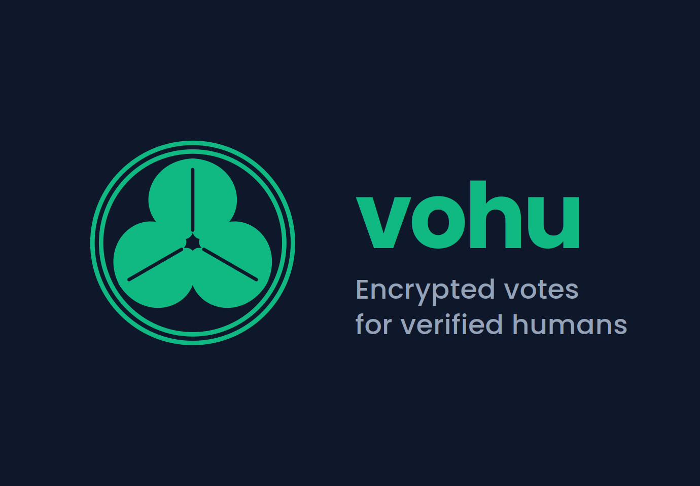

<div align="center">



# vohu

**Encrypted votes for verified humans.**

A privacy-preserving voting Mini App for [World](https://world.org).
World ID guarantees one person, one vote.
Each ballot is encrypted on-device with an additive homomorphic cipher.
The server aggregates ciphertexts homomorphically — only the tally is ever
decrypted.

[Built for World Build 3, April 2026](https://worldbuildlabs.com) · [Live](https://vohu.vercel.app) · [Open in World App](https://world.org/mini-app?app_id=app_7ef7c4ad41af2d289fd9312a18bb8d68)

</div>

---

## The problem

Existing voting tools are stuck at a fork in the road:

| Tool | Sybil-resistant? | Ballot secret? | Tally trust-minimized? |
|---|---|---|---|
| Google Forms, SurveyMonkey, company HR polls | ❌ one person can vote a thousand times | ❌ the admin sees every vote | ❌ |
| On-chain DAO votes (Snapshot, Tally) | 🟡 by token, not by human | ❌ every vote on a public ledger forever | ❌ |
| World App's built-in Polls | ✅ World ID = one human | ❌ the server sees every vote | ❌ |
| **vohu** | ✅ **World ID 4.0 Orb + single-use nullifiers** | ✅ **Paillier ciphertext-only at rest** | ✅ **threshold Paillier — t-of-N trustees jointly decrypt the aggregate, no single party holds the full key** |

vohu is the first Mini App on World that gives you all three.

## How it feels

```
┌───────────────────────────┐     ┌───────────────────────────┐
│                           │     │                           │
│  🔒 Verify with World ID  │ →   │  ✓ HUMAN VERIFIED         │
│                           │     │                           │
│  Orb-level, anonymous     │     │  Should the World         │
│                           │     │  ecosystem prioritize     │
└───────────────────────────┘     │  privacy primitives?      │
                                  │                           │
                                  │  ○ Yes                    │
                                  │  ● Mixed                  │
                                  │  ○ No                     │
                                  │                           │
                                  │  [Cast encrypted vote]    │
                                  └───────────────────────────┘
                                                ↓
                                  ┌───────────────────────────┐
                                  │                           │
                                  │  Should the World …?      │
                                  │  7 verified humans voted  │
                                  │                           │
                                  │  Yes    ████████░░  4     │
                                  │  Mixed  ████░░░░░░  2     │
                                  │  No     ██░░░░░░░░  1     │
                                  │                           │
                                  │  ↓ Show what server sees  │
                                  │                           │
                                  │  🔒 [abc123…, def456…, …] │
                                  │  🔒 […]                   │
                                  └───────────────────────────┘
```

Three taps: verify, vote, reveal aggregate.

## How it works

```
┌──────────────────────────────────────────────────────────────┐
│  World App (WebView)                                         │
│  ┌────────────────────────────┐                              │
│  │ React / Next.js 16         │                              │
│  │                            │                              │
│  │  1. MiniKit.verify()       │  ──── Orb single-use ────→   │
│  │     └─ nullifier_hash      │        nullifier             │
│  │                            │                              │
│  │  2. GET /api/proposal      │  ←───  Paillier public key   │
│  │     └─ fetch pk            │                              │
│  │                            │                              │
│  │  3. Paillier.encrypt(vec)  │  ──── ciphertext vector ──→  │
│  │     └─ vec = [1,0,0]       │                              │
│  │       for 3-option ballot  │                              │
│  │                            │                              │
│  │  4. POST /api/vote         │                              │
│  │     { nullifier,           │                              │
│  │       ciphertextVec }      │                              │
│  └────────────────────────────┘                              │
└──────────────────────────────────────────────────────────────┘
                                            │
                                            ▼
┌──────────────────────────────────────────────────────────────┐
│  Server (Next.js Route Handler)                              │
│  ┌────────────────────────────┐                              │
│  │  · reject if nullifier     │  ←── Sybil resistance        │
│  │    already seen            │                              │
│  │                            │                              │
│  │  · store ciphertextVec     │  ←── confidentiality         │
│  │    — never decrypted       │                              │
│  │                            │                              │
│  │  · GET /api/tally          │                              │
│  │    = homomorphic ∏         │  ←── additive HE             │
│  │    = AWAIT t-of-N trustees │       server cannot decrypt  │
│  │    = combine partials      │       alone                  │
│  │      → aggregate plaintext │                              │
│  └────────────────────────────┘                              │
│                                                              │
│  Trustees (2-of-3): each holds a polynomial share of λ.      │
│  Each signs a partial decryption of the aggregate            │
│  via POST /api/trustee/approve. Server combines the          │
│  partials via Lagrange interpolation — the aggregate's       │
│  plaintext falls out of the composition; the private key     │
│  is never reconstructed as a single object anywhere.         │
│                                                              │
│  Storage: Upstash Redis (Tokyo hnd1).                        │
└──────────────────────────────────────────────────────────────┘
```

### Four independent security properties

1. **Sybil resistance** — World ID 4.0 issues *single-use* nullifiers, one per (human × action). Re-submitting with the same nullifier is rejected server-side.
2. **Ballot confidentiality** — each ballot is a Paillier-encrypted vector. The server stores only ciphertexts and never computes a plaintext for any individual ballot.
3. **Homomorphic tally** — the aggregate is computed by multiplying ciphertexts (Paillier's homomorphic add). Only the sum ciphertext per option is decrypted; individual ballots stay encrypted forever.
4. **Threshold decryption (t-of-N trustees)** — the Paillier private key is split at proposal creation via polynomial secret sharing. The original λ is discarded; each of the N trustees holds a single share. Recovering the aggregate plaintext requires at least t trustees to each submit a partial decryption, which the server combines via Lagrange interpolation. **No single party — including the server — holds enough key material to decrypt any ciphertext alone.**

> Passkeys guard the front door.
> Paillier guards the ballot box.
> t-of-N trustees hold the keys to the box.

### Trust assumption (v1, explicitly)

v1 ships with **threshold Paillier, t=2 of N=3 trustees** (`lib/threshold-paillier.ts`). At proposal creation time the key-generation routine splits λ via polynomial secret sharing and immediately discards the original λ, μ, and polynomial coefficients. The surviving state is:

- `threshold-public` — `{ n, g, threshold, totalParties, combiningTheta, delta }`, served to voters for encryption.
- `share:1`, `share:2`, `share:3` — the three trustee shares.

v1's **demo simplification** is that all three shares are co-located in the same Upstash Redis instance (not distributed to separate trustees). This is called out in code and in the UI — the server retrieves the requested share when a trustee hits `POST /api/trustee/approve` and computes the partial decryption on their behalf. The underlying cryptographic scheme is identical to production (Shoup-style partial decryption + Lagrange combine); only the key distribution path differs.

v2 distributes each share to a distinct trustee device; partial decryption happens client-side; the server never sees any share.

## The three bindings — why vohu gates `/vote` to World App

A coherent voting action requires three cryptographic bindings to all hold at the same time. Login systems need only the first two. Voting systems need all three.

| Binding | Claim it makes | How vohu enforces it |
|---|---|---|
| **Identity** | "this nullifier corresponds to a biologically-unique human" | World ID 4.0 Orb at enrollment time; single-use nullifier per (human × action) |
| **Device** | "this authenticator is bound to a specific piece of hardware" | Secure Enclave / TPM-backed passkey inside World App |
| **Runtime** | "the human who owns this device is operating it **right now**, in a private context" | `prome` — `/vote` and `/result` are gated to the World App WebView on the user's own phone |

Login and attestation only need identity + device. Voting needs runtime binding too, because the *content of the choice* — not just the identity of the voter — is the value being protected. If a voter's choice can be observed or recorded in real time, the system cannot be receipt-free, regardless of how strong the underlying cryptography is.

### Why Chrome fails the runtime binding

A Chrome + World App QR flow (the standard "Sign in with World ID" pattern for web apps) is perfectly fine for login — the nullifier is computed on the phone and returned to Chrome privately. But for voting it opens a coercion channel:

```
attacker (looking at Chrome screen)  →  "Vote 'Yes' and let me see your screen."
voter (scans QR on phone)             →  World App returns nullifier to Chrome ✓ (identity bound)
voter (clicks 'Yes' on Chrome)        →  attacker sees the click ✗ (runtime binding broken)
```

The attacker now holds a verifiable receipt — they watched the click or the screenshot. Vote-selling, coerced voting by an abusive partner, forced voting by a manager, gang-enforced voting: all of these exploit the runtime gap.

`prome` closes that gap by construction: `/vote` and `/result` only render their content inside the World App WebView on the voter's own phone. The voter must physically hold their phone, their biometric must unlock World App, and the ballot selection happens on a private screen they are in sole control of. `prome` is a cheap, construction-level coercion mitigation — it does not reach MACI's cryptographic key-rotation strength, but it is orthogonal to MACI and can be combined with it (and in v3, will be).

### Position in the literature

- [Benaloh 1987] establishes that a secret-ballot system must prevent a voter from being able to *prove* how they voted. The three bindings above are one modern decomposition of that requirement.
- [Juels-Catalano-Jakobsson 2005] formalises "receipt-freeness" and "coercion-resistance". vohu v1 addresses weaker forms: runtime-channel coercion (shoulder surfing, screen recording, forced operation) but not cryptographic-receipt coercion.
- [Helios 2008] explicitly treats coercion resistance as out of scope. vohu goes one step beyond Helios here, for free, via the Mini App constraint.
- [MACI 2019] is the strongest current answer: a coerced voter can silently override their own prior ballot via key rotation. v3's roadmap integrates MACI-style key rotation into the Mini App flow.

## prome — "ciphertext outside, ballot inside"

When vohu is opened in **Chrome, Safari, or any browser that isn't World App**, `/vote` and `/result/*` deliberately render as a wall of civic-stamp-green ciphertext with a prompt to open the app in World App.

This isn't just a narrative flourish — it is the runtime binding mechanism from the previous section, implemented in under 100 lines. It is also the clearest possible demo a judge can see: same URL, two devices, two completely different experiences.

See [`lib/prome.ts`](./lib/prome.ts) and [`components/ObfuscatedScreen.tsx`](./components/ObfuscatedScreen.tsx).

### Why Paillier, not a full FHE engine

For a 3-option secret ballot, aggregation is pure addition. Paillier's additive homomorphism gives us the "compute on encrypted data" property at a fraction of the engineering and runtime cost of a fully homomorphic cipher. Swapping in true FHE (e.g. [`tfhe-rs`](https://github.com/zama-ai/tfhe-rs)) becomes meaningful only when the tally logic grows beyond addition — e.g. ranked-choice, approval voting, or weighted delegation. That's v2 via the [`plat`](https://gitlab.com/Ryujiyasu/plat) crate.

## Stack

| Layer | What | Where |
|---|---|---|
| Identity | World ID 4.0: Orb verification, single-use nullifiers | [`@worldcoin/minikit-js`](https://www.npmjs.com/package/@worldcoin/minikit-js) (1.11) |
| Ballot encryption | Paillier additive HE (2048-bit) | [`paillier-bigint`](https://www.npmjs.com/package/paillier-bigint) (3.4) |
| Ballot-validity proof | [argo](https://gitlab.com/Ryujiyasu/argo) ZKP wrapper (mock today, halo2/arkworks/risc0 planned) | vendored `argo-wasm` |
| Persistence | Upstash Redis via Vercel Marketplace | [`@upstash/redis`](https://www.npmjs.com/package/@upstash/redis) |
| UI | Next.js 16 App Router, Tailwind v4, Turbopack | this repo |
| Deployment | Vercel | [vohu.vercel.app](https://vohu.vercel.app) |

## Routes

| Route | Purpose |
|---|---|
| `/` | World ID sign-in entry. Shows the verify button. |
| `/vote` | Present a ballot; Paillier-encrypt and submit. |
| `/result/[proposalId]` | Aggregate result. Shows trustee-approval progress, or decrypted tally once t-of-N approvals are in. |
| `/trustee?p=<id>&i=<index>` | Trustee-facing approval screen. Contributes one partial decryption. |
| `/hyde-probe` | Sanity check that hyde-wasm loads and roundtrips in the browser (v2 preflight). |
| `/argo-probe` | Sanity check that argo-wasm loads, constructs a `vohu.ballot-validity.v1` statement, and round-trips a mock proof. Wire for the v2 proof layer. |
| `GET /api/proposal?proposalId=…` | Proposal metadata + Paillier public key + threshold params. |
| `POST /api/vote` | Ciphertext-only ingest, nullifier-deduplicated. |
| `GET /api/tally?proposalId=…` | Homomorphic aggregate + combine of submitted partials. Returns `revealed: false` until threshold trustees approve. |
| `POST /api/trustee/approve` | One trustee submits their partial decryption of the current aggregate. |

## Running locally

```bash
pnpm install
pnpm dev
# open http://localhost:3000
```

Required environment variables (`.env.local`):

```bash
NEXT_PUBLIC_APP_ID=app_xxxxxxxxxxxxx
NEXT_PUBLIC_ACTION_ID=rp_xxxxxxxxxxxxx

# Optional — if unset, the store falls back to an in-memory Map (dev-only).
# vohu supports both Upstash-native and Vercel-KV naming.
KV_REST_API_URL=https://<your-upstash>.upstash.io
KV_REST_API_TOKEN=...

# Required for server-side WorldID operations (v2 uses this for signed
# attestations).
WORLDCOIN_SIGNER_ADDRESS=0x...
WORLDCOIN_SIGNER_PRIVATE_KEY=0x...
```

To test the Mini App flow inside World App, expose the dev server via a stable
HTTPS URL (ngrok static domain or a Vercel preview deployment) and set that
URL as the **App URL** in the World Developer Portal.

## Project layout

```
vohu/
├── app/
│   ├── page.tsx                       · / — verify entry
│   ├── vote/page.tsx                  · /vote (Paillier encrypt)
│   ├── result/[proposalId]/page.tsx   · /result/:id (aggregate + trustee-approval state)
│   ├── trustee/page.tsx               · /trustee (trustee partial-decrypt UI)
│   ├── api/
│   │   ├── proposal/route.ts          · GET proposal + pub key + threshold params
│   │   ├── vote/route.ts              · POST ciphertextVec, dedup nullifier
│   │   ├── tally/route.ts             · GET homomorphic aggregate + combine partials if t reached
│   │   └── trustee/approve/route.ts   · POST one trustee's partial decryption
│   ├── hyde-probe/page.tsx            · hyde-wasm preflight
│   ├── providers.tsx                  · MiniKit bootstrap
│   └── layout.tsx                     · metadata + OG card
├── components/
│   └── ObfuscatedScreen.tsx           · prome gating UI
├── lib/
│   ├── tally.ts                       · Paillier primitives (encrypt / agg / types)
│   ├── threshold-paillier.ts          · Shamir share λ + partialDecrypt + Lagrange combine
│   ├── keys.ts                        · per-proposal threshold keygen + persistence
│   ├── partials.ts                    · per-trustee partial-decryption store
│   ├── proposal.ts                    · proposal registry (v1: single demo)
│   ├── store.ts                       · Redis-backed ballot store
│   ├── hyde.ts                        · hyde-wasm wrapper (for /hyde-probe)
│   └── prome.ts                       · World App detection + obfuscate
├── scripts/
│   ├── tally-test.mjs                 · end-to-end threshold tally correctness check
│   ├── threshold-paillier-test.mjs    · pure-math unit tests
│   ├── clear-proposal.mjs             · Redis cleanup when schema changes
│   └── inspect-redis.mjs              · dump keys / partials for diagnostics
├── vendor/hyde-wasm/                  · pre-built hyde-wasm artifacts (vendored)
└── public/
    ├── icon.png                       · app icon (civic seal)
    └── og-image.png                   · Open Graph / Twitter card
```

## Threat model (v1)

| Adversary | What they can do | What they cannot do |
|---|---|---|
| Curious server operator | See the stream of ciphertexts + nullifiers, enforce deduplication, observe that a vote happened | Decrypt any ciphertext — the server does not hold the tally private key; t trustees must cooperate |
| Malicious server operator (v1 demo co-location only) | Read the co-located trustee shares out of Redis | Compromise a production deployment where shares live on distinct trustee devices (v2 roadmap) |
| Colluding t−1 trustees | See their own shares and the partial decryptions of the other trustees | Recover the aggregate plaintext — the threshold polynomial requires at least t partials |
| Network observer | See TLS-wrapped ciphertext going to the server | See plaintexts |
| AI scraping crawler | Fetch SSR HTML | See the ballot content (obfuscated by prome) |
| Future quantum adversary | Break Paillier (RSA-like assumption, vulnerable to Shor's algorithm) | — |

Known v1 limits, called out explicitly:

- **Share distribution is co-located** (demo). All three trustee shares live in the same Upstash Redis instance. The cryptographic scheme is threshold Paillier, but the operational deployment model is single-operator. v2 distributes shares to N distinct trustee devices at proposal creation.
- **Malicious-trustee verifiability**: a trustee could submit a garbage partial decryption; the server cannot detect this yet. v2 adds zero-knowledge proofs per partial (verification keys published at keygen time).
- **Post-quantum**: Paillier is RSA-class and therefore NOT post-quantum. A quantum-equipped adversary with a future archive of ciphertexts could decrypt today's ballots. Mitigation: short proposal lifetimes + v2 migration to lattice-based HE via `plat`.
- **Proposal registry**: v1 ships with a single hard-coded demo proposal. Dynamic proposals are v2.
- **Non-transferable receipts**: receipts are not cryptographically device-bound yet. v2 adds hyde+MiniKit `signMessage` composition.

## Versioned roadmap

vohu is structured so that each version adds one clear property without breaking the ones before it. The order below is also the publishing order we expect to hit.

### v1 — *this submission* (April 2026)

- ✅ World ID 4.0 Orb nullifier — proof-of-personhood.
- ✅ Paillier-encrypted ballots (2048-bit, on-device).
- ✅ Homomorphic aggregation — server never decrypts an individual ballot.
- ✅ Threshold Paillier **2-of-3 trustees** — λ is split at proposal creation, reconstructed only via t partial decryptions of the aggregate.
- ✅ `prome` gating — ciphertext to anything that isn't World App.
- ✅ Redis persistence, Vercel deploy, zero auth friction.

### v2 — Seoul Build Week (May 10–18, 2026)

- **Distributed share delivery.** Each of the N trustee shares is held on a distinct device — the server never sees any share. (v1 co-locates for demo.)
- **Verifiable partial decryption.** Each trustee publishes a NIZK proving their partial was computed correctly, so the combine step can reject a byzantine trustee.
- **Non-transferable receipts.** Each voter receives a Paillier-encrypted receipt whose decryption key is gated by a MiniKit `signMessage` on their device's Secure Enclave. The ciphertext can be copied anywhere; without the device, it's noise. (Coercion resistance, partial.)
- **XMTP-backed chat scoping.** Proposal scoped to a specific World Chat group; eligible voters = group members at snapshot time (verified via XMTP MLS membership).
- **Proposal registry + multi-proposal UI.** No more hard-coded `demo-2026-04`; organizers create, publish, and close proposals from the app.

### v3 — post-Seoul research track

- **Receipt-freeness via MACI-style key rotation.** A voter can overwrite their own ballot before the close-of-poll, with the replacement using a freshly rotated key. A coercer who believes they've purchased a vote cannot tell whether it was replaced. This is the classic MACI bribery-resistance mechanism, applied on top of vohu's proof-of-personhood layer — something no existing system combines.
- **Lattice-based homomorphic tally.** Migrate from Paillier (RSA-class, not PQ) to BFV / BGV / TFHE via the [`plat`](https://gitlab.com/Ryujiyasu/plat) crate. Unlocks ranked-choice, approval, quadratic, and weighted-delegation voting — the tally stops being pure addition.
- **Distributed Key Generation (DKG).** No trusted dealer at keygen; trustees run a DKG protocol so λ is never known to any single party, including the server, at any point in time.
- **Academic writeup.** One-paper summary of the v1→v3 path: *"Proof-of-personhood-native secret-ballot voting with threshold homomorphic tally."*

### Parallel companion — [`hyde-webauthn`](https://gitlab.com/Ryujiyasu/hyde-webauthn)

Same crypto ecosystem (`hyde` + `janus`), packaged as a Linux FIDO2 / WebAuthn authenticator. Lets a Linux machine register as a passkey with Google (and other WebAuthn RPs) without a dedicated security key. Tracks its own release cycle; shares the identity model with vohu's v2 hyde-bound receipts.

## Related repos

- [`hyde`](https://gitlab.com/Ryujiyasu/hyde) — TPM-bound PQC primitives (ML-KEM-768, AES-GCM), published on [crates.io](https://crates.io/crates/hyde). Used by `/hyde-probe` and planned for v2 non-transferable receipts.
- [`janus`](https://gitlab.com/Ryujiyasu/janus) — cross-platform person-binding trait layer (presence assertion via biometrics / PIN / FIDO2).
- [`hyde-webauthn`](https://gitlab.com/Ryujiyasu/hyde-webauthn) — virtual FIDO2 authenticator for Linux.
- [`argo`](https://gitlab.com/Ryujiyasu/argo) — zero-knowledge proof wrapper over halo2 / arkworks / risc0. Ships vohu's `vohu.ballot-validity.v1` statement shape; wired today via `/argo-probe` with the mock backend, swapping in a real backend is a config change.
- [`plat`](https://gitlab.com/Ryujiyasu/plat) — FHE / GPU-accelerated private computation (vohu's future tally layer).

## Related work and vohu's position

Prior art in privacy-preserving voting falls into three mature camps. vohu does not out-research any of them individually — it composes an opinionated subset plus a new identity primitive that didn't exist before 2024.

| System | "Who is a voter?" | Ballot secrecy | Receipt-freeness | Distribution |
|---|---|---|---|---|
| [Helios](https://heliosvoting.org/) (Adida 2008) | Email + password — the operator knows everyone | ElGamal + threshold decryption | **Explicitly out of scope** by the paper | Web app, deployed via IACR, ACM, etc. |
| [Vocdoni / DAVINCI](https://davinci.vote/) (2017 → 2024) | ECDSA key or ERC-20 balance | ElGamal + zk-SNARK census proof | Partial (delay-based) | Vochain / web |
| [MACI](https://maci.pse.dev/) (Buterin / PSE 2019) | One Ethereum key per human, by assumption | ECDH + zk-SNARK | **Strong** — key-rotation-based bribery resistance | Ethereum smart contract (gas required) |
| **vohu** | **Orb-verified World ID** — cryptographic proof-of-personhood, no operator trust | Paillier + threshold decryption | v1 none; v2 via hyde-bound receipts | Mini App in World App (400+ existing user base) |

### Where vohu is genuinely different

1. **Proof-of-personhood is native, not delegated.** Helios assumes the operator knows who's human. Vocdoni delegates to tokens. MACI assumes "1 Ethereum key == 1 human" as an unstated operational invariant. vohu is the first of these systems where *the protocol itself* verifies that each ballot came from a distinct human, via Orb-level World ID.

2. **Paillier, not ZK.** vohu's tally is pure addition, so we use a 2048-bit Paillier cryptosystem — 40-year-old, auditable, no trusted setup, no zk-SNARK circuit. When the tally grows beyond addition (ranked-choice, quadratic, weighted delegation), the roadmap moves to lattice-based HE via [`plat`](https://gitlab.com/Ryujiyasu/plat), not a more expensive zk-SNARK.

3. **`prome` — visual ciphertext on non-World-App browsers.** Same URL, two devices, two completely different experiences. Helios / Vocdoni / MACI demos are text-heavy; vohu's thesis — "the ballot is invisible to anything that isn't a verified human" — can be shown in one head-turn. This is a UX contribution, not a cryptographic one.

4. **Zero install friction.** Helios requires a sign-up flow; MACI requires a wallet with gas; Vocdoni requires a dedicated app. vohu runs inside World App (40M+ verified users, [400+ Mini Apps](https://world.org/blog/announcements/world-launches-mini-apps-1-2)) — two taps from the home screen.

### Honest weaknesses vs prior work

- **Receipt-freeness**: MACI's key-rotation-based bribery resistance is stronger than anything vohu has today. v2 will add hyde-bound receipts (the *receipt* is device-bound so it can't be forwarded to a coercer).
- **Scale**: Vocdoni DAVINCI targets national elections. MACI has production deployments (clr.fund). vohu is a hackathon MVP — near-term targets are small-to-medium DAOs, World Chat community votes, workplace governance.
- **Post-quantum**: Paillier is RSA-class. MACI's SNARK side is also classical. For long-term ballot secrecy against future quantum adversaries, v2 migrates to a lattice-based HE via `plat`.

### One-liner for the pitch

> *Helios solved ballot secrecy in 2008 but assumed you already knew who the humans were.
> MACI solved bribery in 2019 but assumed one Ethereum key per human.
> Vocdoni solved scale but uses tokens as proxies for humanity.
> vohu is the first system where "one human, one secret vote" is true at the cryptographic layer, not the operational layer — because World ID made it possible.*

## References

Core cryptographic primitives that vohu composes:

- Paillier, P. (1999). [*Public-Key Cryptosystems Based on Composite Degree Residuosity Classes.*](https://link.springer.com/chapter/10.1007/3-540-48910-X_16) EUROCRYPT '99. — the additive-homomorphic cipher that protects every ballot in vohu.
- Shoup, V. (2000). [*Practical Threshold Signatures.*](https://www.shoup.net/papers/thsig.pdf) EUROCRYPT '00. — the partial-signature + Lagrange-combine technique we adapt for threshold Paillier.
- Damgård, I., Jurik, M. (2001). [*A Generalisation, a Simplification and Some Applications of Paillier's Probabilistic Public-Key System.*](https://link.springer.com/chapter/10.1007/3-540-44586-2_9) PKC '01. — the canonical threshold Paillier construction.
- Hazay, C., Mikkelsen, G. L., Patra, A., Venkitasubramaniam, M. (2017). [*Efficient RSA Key Generation and Threshold Paillier in the Two-Party Setting.*](https://eprint.iacr.org/2011/494) Journal of Cryptology. — engineering-grade variant of the scheme.

Electronic voting foundations:

- Benaloh, J. (1987). [*Verifiable Secret-Ballot Elections.*](https://www.microsoft.com/en-us/research/publication/verifiable-secret-ballot-elections/) PhD thesis, Yale University. — the origin of homomorphic tallying for secret ballots.
- Cramer, R., Gennaro, R., Schoenmakers, B. (1997). [*A Secure and Optimally Efficient Multi-Authority Election Scheme.*](https://link.springer.com/chapter/10.1007/3-540-69053-0_10) EUROCRYPT '97. — threshold ElGamal elections; architectural ancestor of Helios.
- Adida, B. (2008). [*Helios: Web-based Open-Audit Voting.*](https://www.usenix.org/legacy/events/sec08/tech/full_papers/adida/adida.pdf) USENIX Security '08. — the system vohu's `Related work` table benchmarks against.
- Juels, A., Catalano, D., Jakobsson, M. (2005). [*Coercion-Resistant Electronic Elections.*](https://link.springer.com/chapter/10.1007/11957454_3) WPES '05. — foundational work on receipt-freeness; informs the v2 hyde-bound receipt roadmap.

Recent / practical systems cited above:

- Buterin, V. (2019). [*Minimum Anti-Collusion Infrastructure.*](https://ethresear.ch/t/minimal-anti-collusion-infrastructure/5433) ethresear.ch. Implementation: [`privacy-scaling-explorations/maci`](https://maci.pse.dev/).
- Vocdoni / DAVINCI Protocol (2024). [*Specification*](https://davinci.vote/). — zk-SNARK-based multi-chain voting infrastructure.

Identity and distribution infrastructure:

- Tools for Humanity (2026). [*World ID 4.0 — Proof of Personhood.*](https://world.org/world-id) — the proof-of-personhood layer vohu builds on.
- Tools for Humanity (2025). [*Mini Apps 1.2 & Developer Rewards.*](https://world.org/blog/announcements/world-launches-mini-apps-300k-dev-rewards-pilot-inspire-human-first-apps) — the World App distribution channel.
- Sign-In With Ethereum — [EIP-4361](https://eips.ethereum.org/EIPS/eip-4361). — the SIWE scheme MiniKit's `walletAuth` implements for account binding.

## Credits

Built by [Ryuji Yasukochi](https://github.com/Ryujiyasu) (CTO, [M2Labo](https://m2labo.co.jp)) during the World Build 3 online hackathon, April 2026.

Thanks to the Tools for Humanity team for World ID 4.0 and the MiniKit SDK, and to the privacy research community whose decades of work on secret ballots (Helios, Civitas, selene) and homomorphic encryption (Paillier, Gentry, Zama) is what makes a project like this buildable in a weekend.

## License

MIT. See [LICENSE](./LICENSE).
